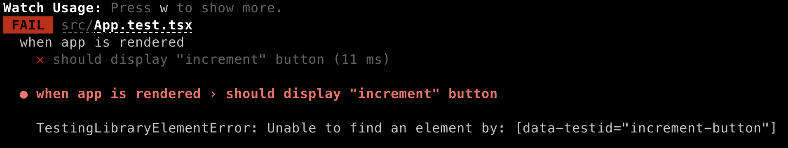
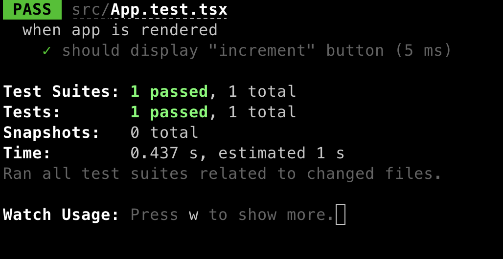

import ImageCredit from '@site/src/components/image-credit'

<ImageCredit>
Photo by <a href="https://www.pexels.com/@jan-van-der-wolf-11680885/">Jan van der Wolf</a> from <a href="https://www.pexels.com/photo/blue-and-yellow-road-sign-8824203/">Pexels</a>
</ImageCredit>


## what is tdd

> Test-driven development (TDD) is a software development process relying on software requirements being converted 
to test cases before software is fully developed, and tracking all software development by repeatedly testing the 
software against all test cases. This is as opposed to software being developed first and test cases created later.

From [wikipedia](https://en.wikipedia.org/wiki/Test-driven_development#Test-driven_development_cycle)

So what does it actually means? 
instead of writing the code first and then adding tests to validate the added behavior, we first write the test and only then implement the new behavior.

Basicly it should look something like this:
### tdd diagram


## why?

Why not just do it the other way around? TDD requirs the developer to change the way he aproaches the problem, when starting to practice it, it might seem unintuitive and the concept might take some time to grasp.
When implementation comes first, we might be biased when writing the tests, since we already know the behavior works as expected, and we might even saw it in action.
When starting with a failing test we know for sure that it's not yet opperational, only when the test switches to green we know we reach our goal.

{/* add more reasons here */}
## how?

In theory is sound pretty nice and simple, lets see how we can actually do it.
We'll use react.js for the examples but the concepts are transsitible to all other frameworks and libraries.
Our test runner will be [Jest](https://jestjs.io/) and the rendering will be done by [Testing Library](https://testing-library.com/docs/react-testing-library/intro)
For this demo i chose to go with [Create React App](https://create-react-app.dev/) since it has the least overhead for starting with testing (ships with both jest and testing library),
for a real world app i would probably go with vite or next.js, depends on the ues case.

### installation

first of all let's get started with this command


```bash
npx create-react-app my-app --template typescript
```

once it's finished we can already run the test that is aleady exist in the project

### run the tests

let's run the test command `npm run test` as you might notice this is running with the watch flag by default, so each file change in the src directory will trigger a re-run of the test command.

### new task requirement

let's assume that we were assigned to develop a simple counter display, with "Increment", "Decrement" and "Reset" functionality
We even got a prototype video of the feature:


let's break that down to smaller blocks of logic:

* Increment
    * Button with "Increment" label should be displayd
    * Click on button should increment count value by once
* Decrement
    * Button with "Decrement" label should be displayd
    * Click on button should decrement count value by once
* Reset
    * Button with "Reset" label should be displayd
    * Click on button should set count value to 0
* Counter
    * should be initiated with 0 as value

Basicly we can use this as a referance to out tdd cycles, if we take increment click functionality and cast it on the [digaram](#tdd-diagram) we saw before it should look something like this:


### First test - Increment button should exists

the first test should check if the button is rendered in document, using Jest's global `describe`, `test` and `expect` functions,
testing-library's `render` function that renders (duh) the elements in the dom (well, not an actual dom, but that's a topic for another article),
and [`screen`] object which represent the document object in which the `render` function rendered info and deeper understand of this, i would suggest reach the official docs of [jest] and [testing-library]


```jsx title="src/App.test.tsx" 
import { render, screen } from '@testing-library/react';
import App from './App';

describe('when app is rendered', () => {
  render(<App />);

  test('should display "increment" button', () => {
    expect(screen.getByTestId('increment-button')).toBeInTheDocument();
  });
});
```
this will be the output for test:



since this we didn't implement the button in the code, the test is failing, now let's add the button:

```jsx title="src/App.tsx" 
import React from 'react';
import logo from './logo.svg';
import './App.css';

function App() {
  const [count, setCount] = React.useState(0);
  return (
    <div className='App'>
        <button data-testid={'increment-button'}>
            Increment
        </button>
    </div>
  );
}

export default App;
```




## FAQ

Q:  
A:

refs:

https://docs.google.com/presentation/d/1PEoyCYUAw7vaSkTzRG7DfU_81T2j-I1OJ21PxsaVYH4/edit?pli=1#slide=id.g1fe029b5a1a_0_32

https://create-react-app.dev/docs/getting-started#creating-an-app

https://en.wikipedia.org/wiki/Test-driven_development#Test-driven_development_cycle

todos:
[] link to FAQ
[] change color in first diagram
[] optional: make gif shorter