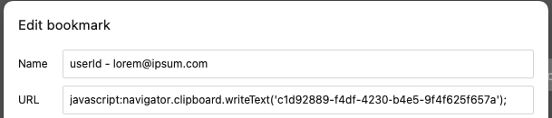

import ImageCredit from '@site/src/components/image-credit'

<ImageCredit>
Photo by <a href="https://unsplash.com/@olia?utm_source=unsplash&utm_medium=referral&utm_content=creditCopyText">Olia 💙💛 Gozha</a> on <a href="https://unsplash.com/photos/J4kK8b9Fgj8?utm_source=unsplash&utm_medium=referral&utm_content=creditCopyText">Unsplash</a>
</ImageCredit>


> ### tl;dr: add javascript code as the url value of a bookmark to execute it when you click on the bookmark.

A while back I discovered a neat trick that you can do with bookmarks in the browser, instead of inserting a url, just add some javascript.
wait, what?
when creating a new bookmark in your browser, you can add a url, but you can also add some javascript code, and when you click on the bookmark, the code will be executed.
this is a very powerful feature, and I use it all the time.
Basically, any javascript code that you can run in the console, you can run in a bookmark.

So, what can we do with this?
Let's see some examples:



## Copy to clip board a string that you use often

```javascript
navigator.clipboard.writeText('ce34839b-5eca-4ab5-86ac-02cc8ba76c8e');
```

we can use this to copy to the clipboard a string that we use often, like a uuid, or a url, or anything else.
seems pretty basic, but it's very useful.

:::note
Don't forget to add the `javascript:` prefix to the code, otherwise it won't work.
:::

## Fetch data from an api

we can also use this to fetch data from an api, and display it in the console.

```javascript
fetch('https://jsonplaceholder.typicode.com/todos/1')
  .then((response) => response.json())
  .then((json) => console.log(json));
```

## Go to a random wikipedia page

Want to read an interesting wikipedia article, but don't know which one to choose?

```javascript
window.open(
  'https://en.wikipedia.org/wiki/Special:RandomInCategory/Good_articles',
  '_blank'
);
```

## What's next?

As you can see, the possibilities are endless, and you can use this to automate a lot of things that you do often.
You can check out these repos for more ideas and inspiration:

[https://github.com/Krazete/bookmarklets](https://github.com/Krazete/bookmarklets)

[https://github.com/marcobiedermann/awesome-bookmarklets](https://github.com/marcobiedermann/awesome-bookmarklets)

:::warning
Be aware of the security implications of running unknown javascript code from a bookmark,
and don't run code that you don't trust.
:::