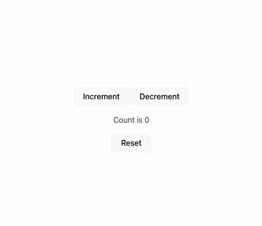

import ImageCredit from '@site/src/components/image-credit'

<ImageCredit>
Photo by <a href="https://www.pexels.com/@jan-van-der-wolf-11680885/">Jan van der Wolf</a> from <a href="https://www.pexels.com/photo/blue-and-yellow-road-sign-8824203/">Pexels</a>
</ImageCredit>


## Prerequisites
Before diving into TDD with React, you should be familiar with:
- Basic React concepts (components, state, props)
- JavaScript/TypeScript fundamentals
- Command line basics
- Basic understanding of testing concepts

## What is Test-driven development?

> Test-driven development (TDD) is a software development process relying on software requirements being converted 
to test cases before software is fully developed, and tracking all software development by repeatedly testing the 
software against all test cases. This is as opposed to software being developed first and test cases created later.

*From [wikipedia](https://en.wikipedia.org/wiki/Test-driven_development#Test-driven_development_cycle)*

So what does it actually mean? 
Instead of writing the code first and then adding tests to validate the added behavior, we first write the test and only then implement the new behavior.

Basically it should look something like this:

### TDD Diagram


### Why not just do it the other way around?

TDD requires the developer to change the way they approach the problem. When starting to practice it, it might seem unintuitive and the concept might take some time to grasp.
When implementation comes first, we're biased - TDD avoids this by starting with a failing test.
When starting with a failing test we know for sure that it's not yet operational, only when the test switches to green do we know we've reached our goal.

## How?

In theory it sounds pretty nice and simple, let's see how we can actually do it.
We'll use React.js for the examples but the concepts are transferable to all other frameworks and libraries.
Our test runner will be [Vitest](https://vitest.dev/) and the rendering will be done by [Testing Library](https://testing-library.com/docs/react-testing-library/intro)
I chose Vite for this demo because it's fast, modern, and integrates smoothly with Vitest.

### Installation & Setup

First of all let's get started with this command

```bash
npm create vite@latest my-app -- --template react-ts
cd my-app
npm install
```

Once it's finished we need to set up our testing environment. Let's install the necessary testing dependencies:

```bash
npm install --save-dev vitest @testing-library/react @testing-library/dom @types/react @types/react-dom jsdom
```

Add a `vitest.config.ts` file to the root of the project with the following content:

```ts title="vitest.config.ts"
import { defineConfig } from 'vitest/config'
import react from '@vitejs/plugin-react'

// https://vite.dev/config/
export default defineConfig({
  plugins: [react()],
  test: {
    environment: 'jsdom',
  },
})
```

Add test scripts to your `package.json`:

```json title="package.json"
{
  "scripts": {
    "test": "vitest"
  }
}
```

### Create Our First Spec File
For now let's just create a simple spec file to make sure everything is working as expected.

```tsx title="src/App.spec.ts"
import { describe, expect, it } from 'vitest'

describe('AppComponent', () => {
  it('should return true', () => {
    expect(true).toBe(true);
  });  
});
```

### Run the Tests

Let's run the test command `npm run test`. Vitest runs in watch mode by default, so each file change in the src directory will trigger a re-run of the test command.

You should see something like this:


Awesome, everything is working as expected!
We are ready to start our TDD journey. 🥳

### New Task Requirement

Let's assume that we were assigned to develop a simple counter display, with "Increment", "Decrement" and "Reset" functionality.
We even got a prototype video of the feature:


Let's break that down into smaller blocks of logic:

* Increment
    * Button with "Increment" label should be displayed
    * Clicking the button should increment the count by one
* Decrement
    * Button with "Decrement" label should be displayed
    * Clicking the button should decrement the count by one
* Reset
    * Button with "Reset" label should be displayed
    * Clicking the button should set the count to 0
* Counter
    * Should be initialized with 0 as value

Basically we can use this as a reference to our TDD cycles. If we take increment click functionality and cast it on the [diagram](#tdd-diagram) we saw before it should look something like this:


### 1st Test - Increment Button Should Exist

First of all let's clear the existing `App.tsx` file so it will return an empty `div` element:
    
```jsx title="src/App.tsx" 
import React from 'react';
import './App.css';

function App() {
  return (
    <div />
  );
}

export default App;
```

The first test should check if the button is rendered in the document, using Vitest's global `describe`, `test` and `expect` functions,
Testing Library's `render` function that renders the elements in the DOM (well, not an actual DOM, but that's a topic for another article),
and [`screen`] object which represents the document object in which the `render` function rendered. For a deeper understanding of this, I would suggest reading the official docs of [Vitest](https://vitest.dev/) and [Testing Library](https://testing-library.com/).


```tsx title="src/App.test.tsx" 
import { describe, expect, test } from 'vitest'
import App from './App'
import { render, screen } from '@testing-library/react';

describe('when app is rendered', () => {
  test('should display "increment" button', () => {
    render(<App />);

    expect(screen.getByText('Increment')).toBeDefined()
  });
});
```
This will be the output for the test:


Let's go over what happened here. Since the button element wasn't implemented yet, `getByText` function couldn't find it in the DOM.

Since we didn't implement the button in the code, the test is failing. Now let's add the button:

```jsx title="src/App.tsx" {8-10}
import React from 'react';
import logo from './logo.svg';
import './App.css';

function App() {
  return (
    <div>
        <button>
            Increment
        </button>
    </div>
  );
}

export default App;
```

Now the test would pass, as the target element is found


### 2nd Test - Click on Button Should Increment Counter

The next step in our test flow should be "when user clicks on increment, counter should be incremented by one", but before we do that, we should test that the default count value is 0.

So let's add the following test:
```tsx title="src/App.test.tsx" {7,18-21} 
import { describe, expect, test, beforeEach } from 'vitest'
import App from './App'
import { cleanup, render, screen } from '@testing-library/react';

describe('when app is rendered', () => {
  beforeEach(() => {
    cleanup();
  });

  test('should display "increment" button', () => {
    render(<App />);

    expect(screen.getByText('Increment')).toBeDefined()
  });

  test('should initiate counter with 0', () => {
    render(<App />);
    expect(screen.getByText('Count is 0')).toBeDefined();
  });
});

```

After this second test fails, we can add this logic:
```jsx title="src/App.tsx" {5,9}
import React from 'react';
import './App.css';

function App() {
  const [count] = React.useState(0);

  return (
    <div>
      <button>Increment</button>
      <p>Count is {count}</p>
    </div>
  );
}

export default App;
```

Now the test should pass.

### 3rd Test - Click on Increment Button Should Increment Counter

Now let's test the actual increment functionality. We need to test that when the user clicks the increment button, the counter value increases by 1,
We'll use [user-event](https://testing-library.com/docs/user-event/intro/) library to simulate user interactions.

```tsx title="src/App.test.tsx" {4,24-29}
import { describe, expect, test, beforeEach } from 'vitest'
import App from './App'
import { cleanup, render, screen } from '@testing-library/react';
import { userEvent  } from '@testing-library/user-event';

describe('when app is rendered', () => {
  beforeEach(() => {
    cleanup();
  });

  test('should display "increment" button', () => {
    render(<App />);

    expect(screen.getByText('Increment')).toBeDefined()
  });

  test('should initiate counter with 0', () => {
    render(<App />);
    expect(screen.getByText('Count is 0')).toBeDefined();
  });

  test('should increment counter when increment button is clicked', async () => {
    render(<App />);
    
    await userEvent.click(screen.getByText('Increment'));
    expect(screen.getByText('Count is 1')).toBeDefined();
  });
});
```

This test will fail because we haven't implemented the click handler yet. Let's add the functionality:

```tsx title="src/App.tsx" {9}
import { useState } from 'react'
import './App.css'

function App() {
  const [count, setCount] = useState(0)

  return (
    <div>
      <button onClick={() => setCount((count) => count + 1)}>Increment</button>
      <p>Count is {count}</p>
    </div>
  )
}

export default App
```

Now all tests should pass! We've successfully implemented the increment functionality using TDD.
Now you can follow the same pattern to implement the Decrement and Reset functionalities,
but remember to always start with a failing test first, and then make it pass. 


## Benefits of TDD in Practice

Through this example, we can see several key benefits of TDD:

* **Avoiding Uncovered Cases**: By writing tests first, we ensure that all edge cases are considered and tested, when we write the code first we might miss some edge cases.
* **Avoiding False Positives**: By writing the test first, we avoid the risk of writing code that appears to work but doesn't actually meet the requirements


## FAQ


**Q: What's the difference between unit tests and integration tests in the context of TDD?**  
A: Unit tests focus on individual components or functions in isolation, while integration tests verify that multiple components work together correctly. TDD typically starts with unit tests and progresses to integration tests.

**Q: Is TDD slower than traditional development?**  
A: Initially, TDD might feel slower, but it often saves time in the long run by catching bugs early, reducing debugging time, and making refactoring safer.

**Q: Can I use TDD with existing codebases?**  
A: Yes! You can start applying TDD to new features or when refactoring existing code. You don't need to rewrite everything to benefit from TDD principles.

**Q: What about testing UI components? Isn't that brittle?**  
A: When testing UI components, focus on user behavior rather than implementation details. Use semantic queries (like `getByRole`, `getByLabelText`) instead of brittle selectors, and test what the user would actually do.

**Q: When is TDD not the most efficient approach?**  
A: TDD works best for well-defined, stable requirements. It may not be ideal for rapid prototyping, exploratory programming, or when requirements are constantly changing. In these cases, you might start with a prototype first, then add tests as the feature stabilizes. TDD also requires more upfront investment, so for very small scripts or one-off utilities, the overhead might not be worth it.

## Conclusion

Test-Driven Development is more than just a testing strategy - it's a design methodology that helps you build more reliable, maintainable software. By writing tests first, you're forced to think about your API design, error cases, and user requirements before diving into implementation.

The counter example we built demonstrates the core TDD cycle: Red (write a failing test), Green (make it pass with minimal code), and Refactor (improve the code while keeping tests green - we didn't focus on it as much). This approach ensures that every line of code you write has a clear purpose and is thoroughly tested.

While TDD may feel slower initially, the benefits compound over time. Once a good infrastructure is in place, you'll spend less time debugging, have more confidence when refactoring, and create better-designed code. The tests serve as both specification and safety net, making your codebase more robust and maintainable.

Start small with TDD—pick one new feature or bug fix and apply the Red-Green-Refactor cycle. As you become more comfortable with the process, you'll find that TDD becomes a natural part of your development workflow.

## Ready to Start TDD?
Try implementing the decrement and reset functionality using the same TDD approach we covered. Remember: Red → Green → Refactor!

The key to mastering TDD is practice. Start with small features and gradually work your way up to more complex functionality. The investment in writing tests first pays off with more reliable, maintainable code.

## References

- [Test-driven development - Wikipedia](https://en.wikipedia.org/wiki/Test-driven_development#Test-driven_development_cycle)
- [Vite - Getting Started](https://vitejs.dev/guide/)
- [Vitest Documentation](https://vitest.dev/)
- [React Testing Library Documentation](https://testing-library.com/docs/react-testing-library/intro)
